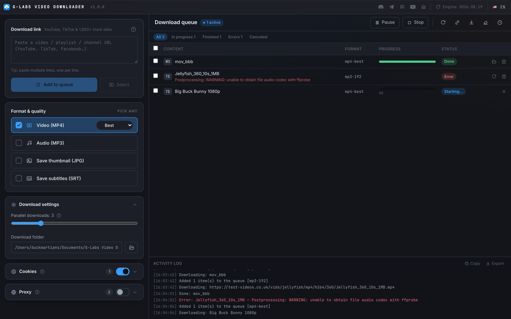
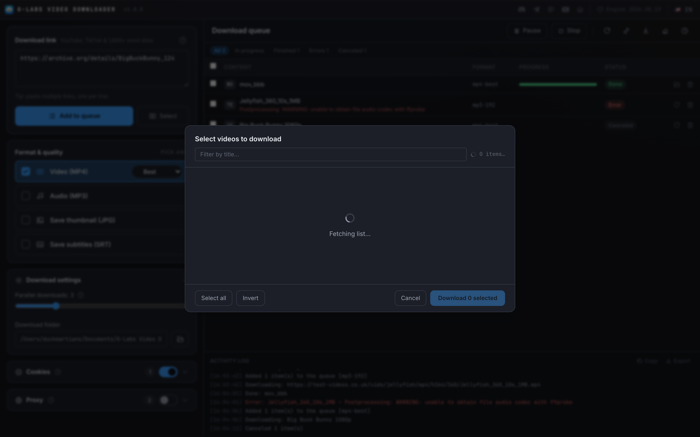
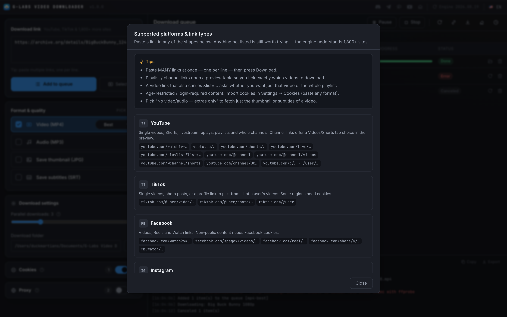
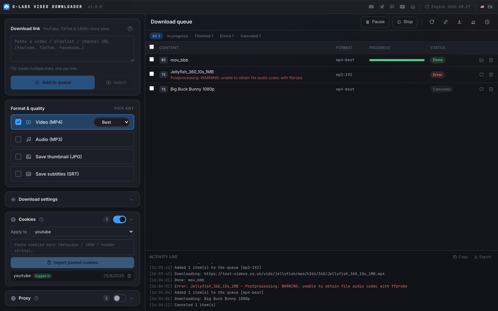
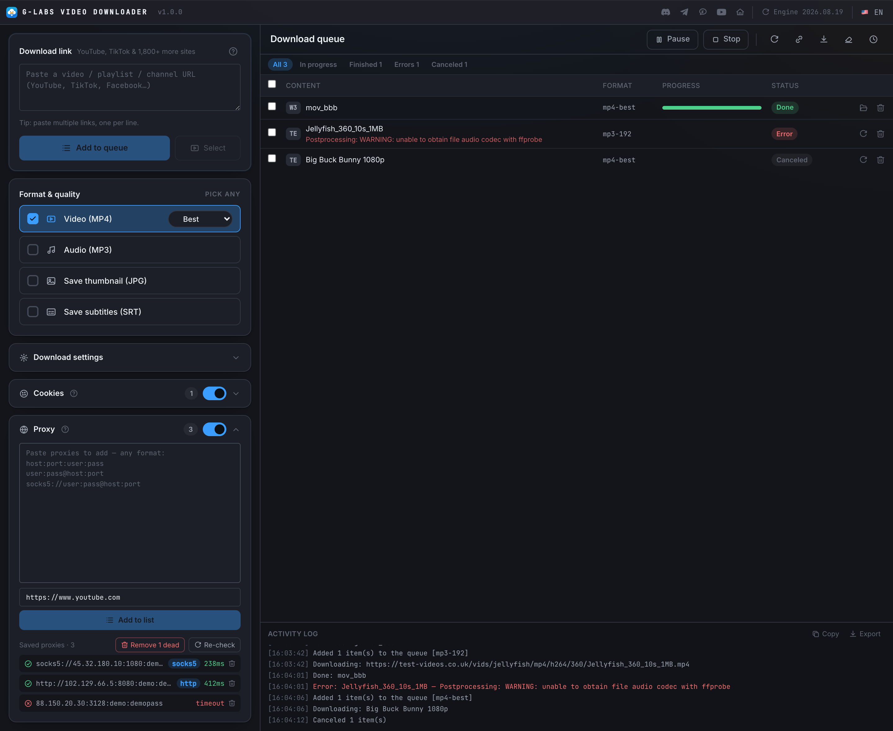
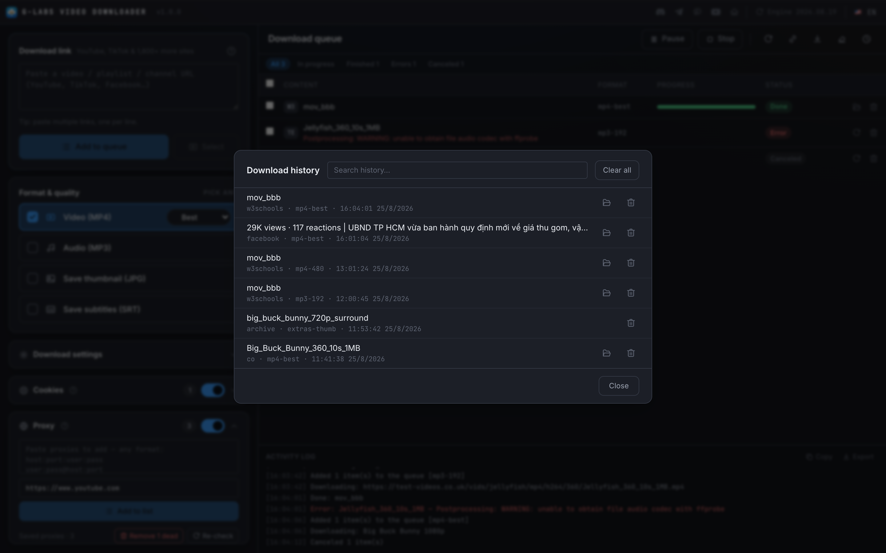
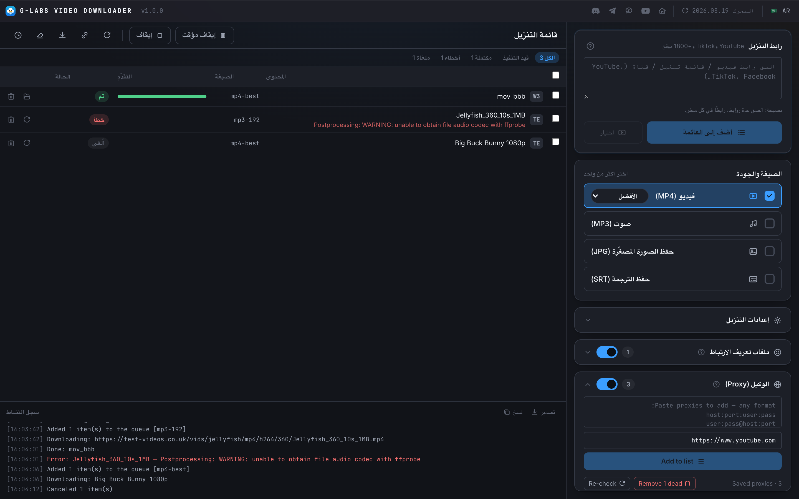

# G-Labs Video Downloader

**English** | [Tiếng Việt](README.vi.md)

Desktop app for downloading videos from **YouTube, TikTok, Facebook, Instagram, X/Twitter, Twitch, Vimeo, Reddit, SoundCloud, Bilibili and 1,800+ other sites** — with a bundled, self-updating multi-platform download engine. Everything ships in the app; nothing else to install.

## Features

- **Paste anything**: single videos, playlists, whole channels, YouTube Shorts — one link per line for bulk adds; a **?** button opens a detailed guide of every supported platform & link shape
- **Formats, multi-select**: pick any combination in one pass — MP4 (best / 1080p / 720p / 480p, selected as a **height cap**) · MP3 (320 / 256 / 192 / 128 kbps) · thumbnail JPG · subtitles SRT · **extras-only** (grab the thumbnail/subtitles without the video)
- **Add then download**: links go into a table first — Start / Pause / Stop are separate actions, so you queue everything and download when ready
- **Parallel queue**: 1–10 concurrent downloads with per-item progress, speed and ETA; **status filters** (in-progress / finished / errors / canceled) plus row selection with bulk "run selected"
- **Playlist / channel preview**: fetch the item list first and tick exactly what you want (Videos/Shorts tabs for YouTube channels); the list streams in live so you can start before it finishes
- **Smart dedup**: a persistent history skips videos you already have (per format) — one click to re-download anyway
- **Retry**: per-item and retry-all for failed downloads (plus the engine's own retry with backoff)
- **Export CSV / direct links**: export the queue + errors (Excel-friendly UTF-8 BOM), or resolve direct media URLs without downloading; activity log with copy/export buttons
- **Cookies, saved per platform**: paste ANY format — Netscape `cookies.txt`, browser-extension JSON export, or a raw `a=1; b=2` header string — for age-restricted / login-required videos and **private playlists**. Each saved cookie shows whether it is actually **logged in**
- **Proxy pool**: paste proxies in any format (`host:port:user:pass`, `user:pass@host:port`, full `socks5://` URLs, IPv6) and **add them to a saved list**; downloads rotate through it round-robin. **Re-check** tests every proxy, auto-detects its type (HTTP/SOCKS4/SOCKS5) and tags the dead ones — then **remove the expired** ones in one click
- **Self-updating engine**: the download engine updates itself every 24 h (+ a manual button) so site changes don't break you
- **App auto-update**: checks GitHub Releases, downloads and installs in-app
- **6 languages**: English, Tiếng Việt, 简体中文, Español, العربية (RTL), Русский

## Screenshots

| Playlist / channel preview | Supported-links guide |
|---|---|
|  |  |

| Cookies (per platform, login state) | Proxy pool (saved list, round-robin) |
|---|---|
|  |  |

| Download history | RTL (العربية) |
|---|---|
|  |  |

## Cookies that last (YouTube)

YouTube **rotates its login cookies every few hours**, so a cookie file exported from your everyday browser goes stale quickly — it works right after import, then fails on the next session even though the file is still saved in full. For long-lived cookies:

1. Open an **Incognito / Private window** and sign in to YouTube.
2. **Export the cookies** (e.g. the Cookie-Exporter extension) right away.
3. **Close the incognito window** immediately — don't open any other YouTube tab.

The frozen incognito session isn't refreshed by a running browser, so the exported cookies stay valid far longer. A copied `document.cookie` header string won't work at all — the login cookies are HttpOnly and invisible to it.

## Install

Grab the latest from [Releases](https://github.com/duckmartians/G-Labs-Video-Downloader/releases):

- **Windows**: `GLabsVideoDownloader-<version>-setup.exe`
- **macOS (Apple Silicon)**: `GLabsVideoDownloader-<version>-arm64.dmg` — unsigned; first open: right-click → Open, or `xattr -dr com.apple.quarantine "/Applications/G-Labs Video Downloader.app"`

Settings and history live in the OS per-user data folder (`%APPDATA%\G-Labs Video Downloader` on Windows, `~/Library/Application Support/G-Labs Video Downloader` on macOS). Downloads default to `Documents/G-Labs Video Downloader`.
