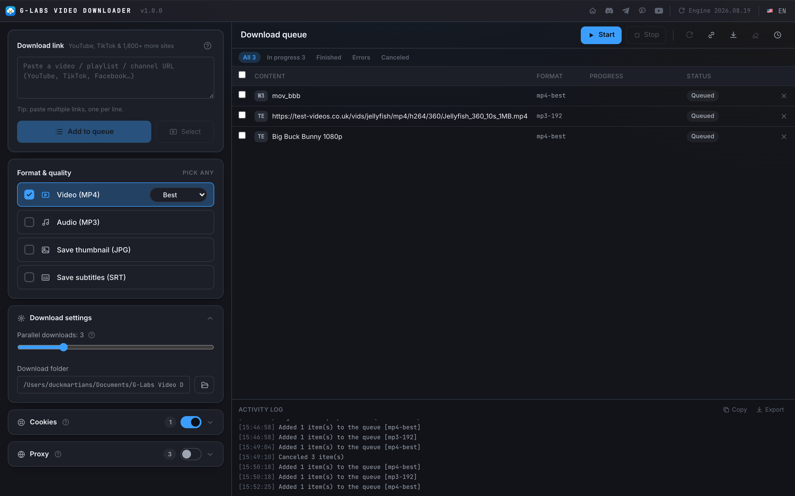
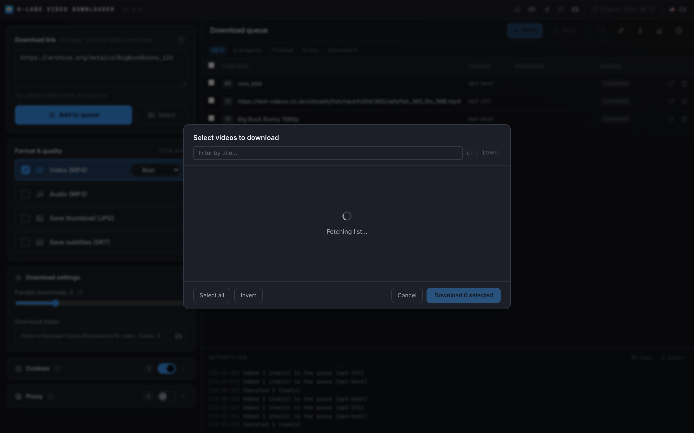
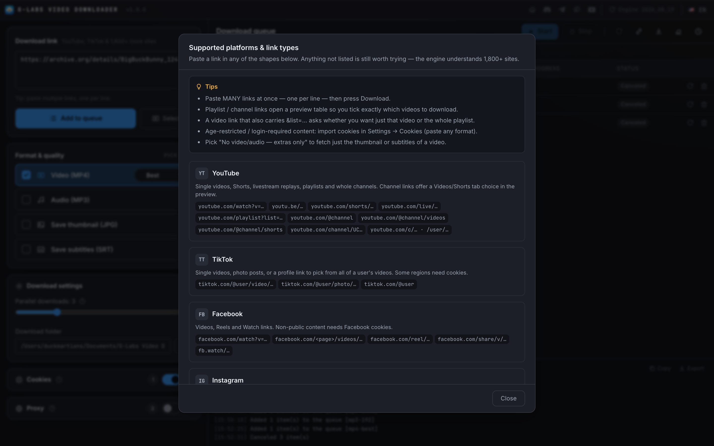
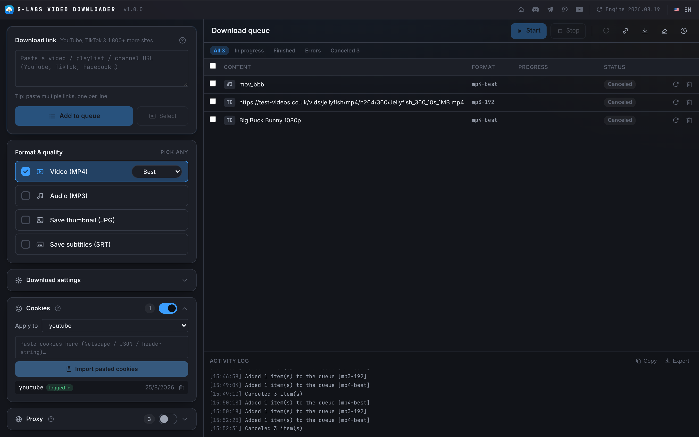
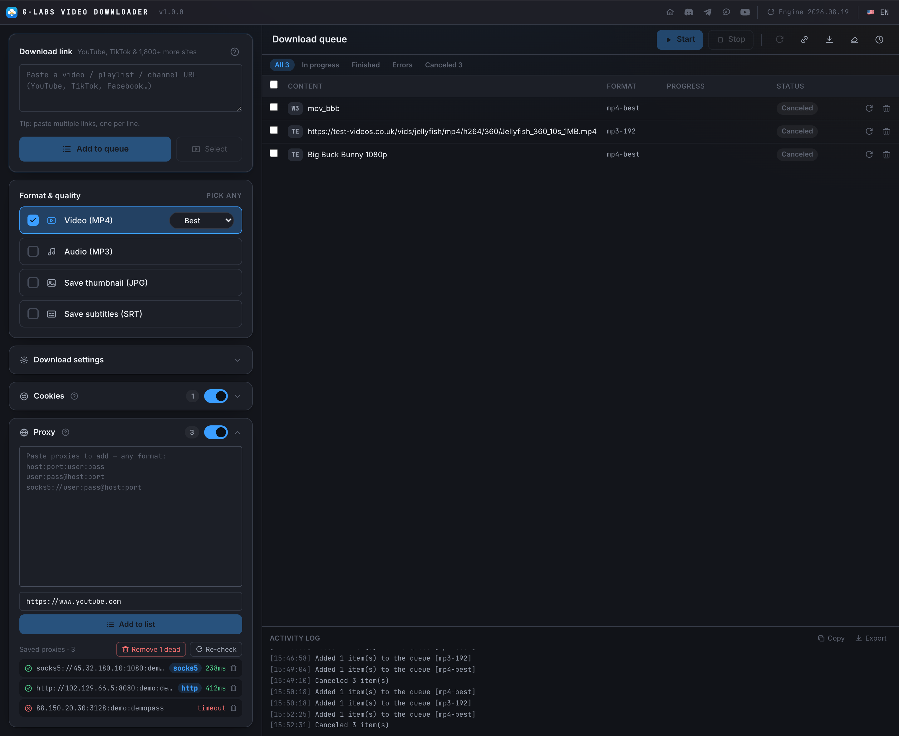
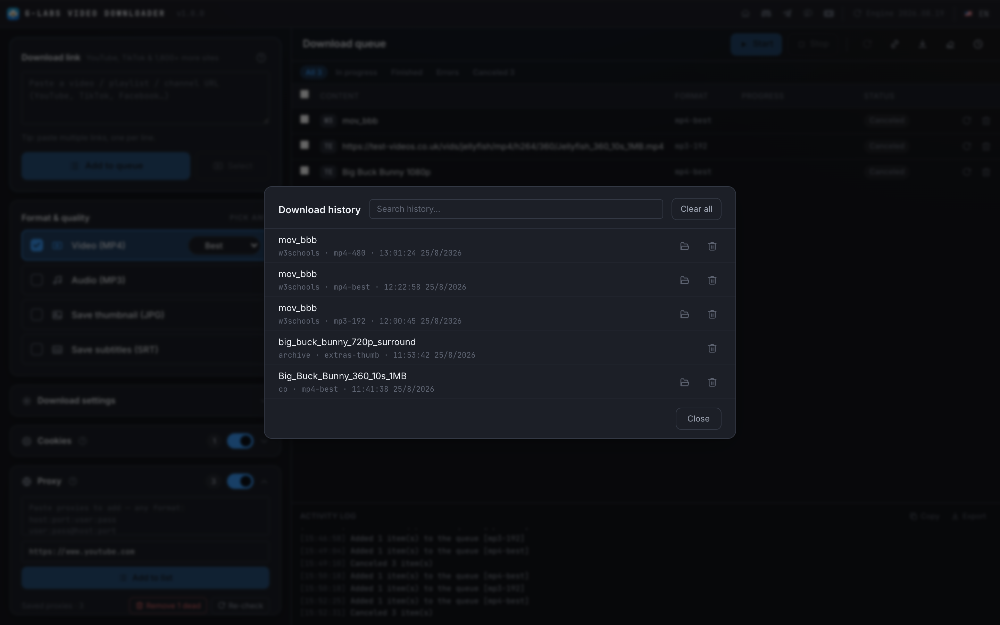
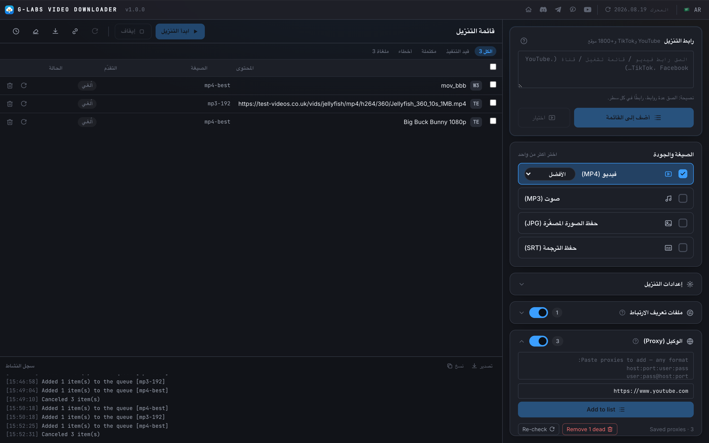

# G-Labs Video Downloader

[English](README.md) | **Tiếng Việt**

Ứng dụng desktop tải video từ **YouTube, TikTok, Facebook, Instagram, X/Twitter, Twitch, Vimeo, Reddit, SoundCloud, Bilibili và hơn 1.800 trang khác** — với engine tải đa nền tảng tự cập nhật đóng gói sẵn. Mọi thứ nằm trong app, không cần cài thêm gì.

## Tính năng

- **Dán gì cũng được**: video lẻ, playlist, cả kênh, YouTube Shorts — dán nhiều link mỗi dòng một link; nút **?** mở hướng dẫn chi tiết mọi nền tảng & kiểu link hỗ trợ
- **Chọn nhiều định dạng cùng lúc**: MP4 (tốt nhất / 1080p / 720p / 480p, chọn là **mức trần** độ phân giải) · MP3 (320 / 256 / 192 / 128 kbps) · ảnh thumbnail JPG · phụ đề SRT · **chỉ-lấy-kèm** (thumbnail/phụ đề mà không tải video)
- **Thêm rồi mới tải**: link vào bảng trước — Bắt đầu / Tạm dừng / Dừng là các nút riêng, thêm hết rồi tải khi sẵn sàng
- **Hàng đợi song song**: 1–10 luồng, hiển thị %, tốc độ, thời gian còn lại; **lọc theo trạng thái** (đang xử lý / hoàn thành / lỗi / huỷ) + tick chọn hàng và "chạy mục chọn"
- **Xem trước playlist / kênh**: lấy danh sách trước, tick đúng video muốn tải (kênh YouTube có tab Video/Shorts); danh sách chảy về theo thời gian thực, **quét chọn nhanh** bằng cách kéo chuột
- **Chống tải trùng**: lịch sử tải bền vững, tự bỏ qua video đã tải (theo định dạng) — bấm một nút nếu muốn tải lại
- **Thử lại**: từng video hoặc tất cả video lỗi (engine cũng tự retry với backoff)
- **Xuất CSV / lấy link**: xuất hàng đợi + lỗi (Excel đọc đẹp, UTF-8 BOM), hoặc lấy link tải trực tiếp mà không cần tải; nhật ký hoạt động có nút copy/xuất
- **Cookie lưu theo nền tảng**: dán định dạng NÀO cũng được — `cookies.txt` Netscape, JSON từ extension, hoặc chuỗi header thô `a=1; b=2` — cho nội dung giới hạn tuổi / cần đăng nhập và **playlist riêng tư**. Mỗi cookie đã lưu hiện rõ có **đăng nhập** hay không
- **Proxy pool**: dán proxy định dạng nào cũng được (`host:port:user:pass`, `user:pass@host:port`, URL `socks5://`, IPv6) và **thêm vào danh sách đã lưu**; mỗi video tải xoay vòng qua danh sách. **Kiểm tra lại** test từng proxy, tự nhận diện loại (HTTP/SOCKS4/SOCKS5) và đánh dấu proxy hỏng — rồi **xoá hết proxy hết hạn** trong một cú bấm
- **Engine tự cập nhật**: engine tải tự update mỗi 24h (+ nút thủ công) nên trang đổi gì cũng không sợ hỏng
- **App tự cập nhật**: kiểm tra GitHub Releases, tải và cài ngay trong app
- **6 ngôn ngữ**: English, Tiếng Việt, 简体中文, Español, العربية (RTL), Русский

## Ảnh màn hình

| Xem trước playlist / kênh | Hướng dẫn link hỗ trợ |
|---|---|
|  |  |

| Cookie (theo nền tảng, trạng thái đăng nhập) | Proxy pool (danh sách, xoay vòng) |
|---|---|
|  |  |

| Lịch sử tải | RTL (العربية) |
|---|---|
|  |  |

## Để cookie YouTube dùng được lâu

YouTube **xoay vòng cookie đăng nhập vài giờ một lần**, nên cookie export từ trình duyệt thường sẽ hỏng nhanh — vừa nhập thì tải được, sang phiên sau lại hết hạn dù file vẫn còn nguyên. Để cookie bền:

1. Mở **cửa sổ ẩn danh (Incognito)** và đăng nhập YouTube.
2. **Export cookie ngay** (vd extension Cookie-Exporter).
3. **Đóng luôn cửa sổ ẩn danh** — đừng mở tab YouTube nào khác.

Phiên ẩn danh bị "đóng băng", không có trình duyệt nào tiếp tục xoay token, nên cookie export ra giữ giá trị lâu hơn nhiều. Chuỗi header `document.cookie` sao chép tay sẽ **không dùng được** — cookie đăng nhập là HttpOnly, JS không đọc thấy.

## Cài đặt

Tải bản mới nhất tại [Releases](https://github.com/duckmartians/G-Labs-Video-Downloader/releases):

- **Windows**: `GLabsVideoDownloader-<version>-setup.exe`
- **macOS (Apple Silicon)**: `GLabsVideoDownloader-<version>-arm64.dmg` — chưa ký; mở lần đầu: chuột phải → Open, hoặc `xattr -dr com.apple.quarantine "/Applications/G-Labs Video Downloader.app"`

Thiết lập và lịch sử nằm trong thư mục dữ liệu người dùng của HĐH (`%APPDATA%\G-Labs Video Downloader` trên Windows, `~/Library/Application Support/G-Labs Video Downloader` trên macOS). Video tải về mặc định vào `Documents/G-Labs Video Downloader`.
